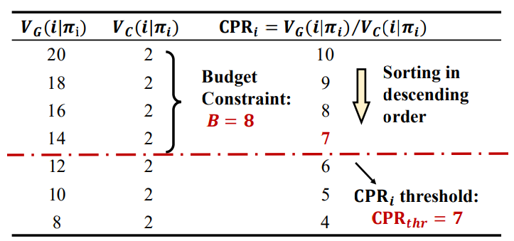
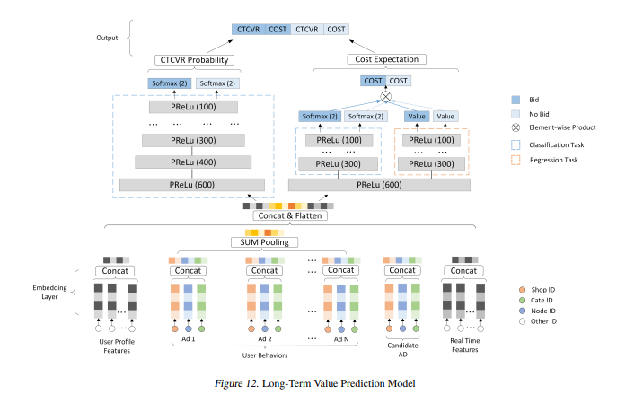
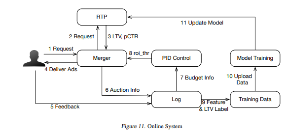

今天介绍一篇阿里出品的广告序列投放算法 [链接](https://arxiv.org/abs/2006.16312)，这篇文章通过考虑用户在端上的长期价值，并且通过将序列投放问题建模为动态背包问题，最后给出了近似解。<!-- more -->总得来说是比较有意思的解决问题的方式，但是我不太认为在线上环境能够取得很不错的效果，原因后面分析。

# 背景

现在的电商平台中，通过在一定预算约束下去优化GMV，也就是提高广告主的ROI是广告主的核心诉求之一。现有的绝大多数出价策略将一段时间的GMV优化问题拆解为：对每次用户的请求进行独立优化，并且认为这些独立优化汇总结果可以等同于这一段时间的GMV最优化。事实上，这类策略得到解可能只是次优解，因为他们以孤立的视角把消费者和广告限定在了单次交互中，而忽略了一段时间内多次交互可能产生的其他影响。

上面一段话可能有点绕，作者在这里举了一个例子，首先，同一个消费者在一段时间内（比如3天）会多次访问淘宝，并且随机地在淘宝不同场景出现（例如首页、购后），这为同一个广告和同一个消费者在不同场景多次接触创造了机会；其次，大量的成交并非发生在消费者和广告的初次接触中，而是发生在第二次或者以后更多次的接触中，通过ab实验，作者发现广告和消费者的前序接触会影响消费者对该广告在后续接触中的点击率和转化率，说明多次的接触对消费的心智有积累影响的效应，在这样的背景下，单次请求优化结果的积累很容易导致次优解。

然而，基于长期价值的序列投放算法在解决预算约束下GMV的优化问题时存在诸多挑战：

1. 优化目标是长期的累积价值，而决策的粒度是单次的；如何基于长期价值的预估获得最优的单次决策？
2. 长期价值预估模型的学习离不开策略探索生成的序列数据。长期价值预估模型和决策模型的学习如何保证收敛性？如何保证决策的最优性？如何提升探索策略的效率？
3. 如何保障预算约束的满足？

针对这些挑战，作者逐一给出了解决方案，首先，将预算约束问题建模为背包问题：背包中物品的价值为<用户，ad>形成的序列价值（长期成交、收藏加购等），物品的重量为此序列中发生的成本（消耗）；我们按照性价比（序列价值/成本）由高到低逐个选择物品，直到选出的物品总消耗刚好不超过预算约束。这里，由于物品的重量远远小于背包的容量，按性价比排序的贪心算法能够接近最优解。然而，每个序列的价值和成本与运营该序列的广告策略有关，因此这是一个动态背包问题，为求解此动态背包，作者采用了双层优化问题的迭代解法来求解：1）物品的贪心选择，2）物品价值/成本以及对应策略的优化。在此框架下，我们提出了一种理论最优的运营策略，该策略满足强化学习中的Policy lteration，能够保证其学习的收敛性。此外，为了使策略在实际场景中落地，，作者提出了一种将连续出价转换为离散动作的方法，能够在不丢失出价精度的情况下，大幅度减少动作的探索时间，提高学习效率。综上，作者将整个算法称之为MSBCB。

# 建模方法

**问题定义：**对于某个广告，我们需要在一定的预算约束$B$下优化一段时间窗口内的成交金额，这个过程可以被建模为一个背包问题：我们把预算约束当做背包的总空间，把用户与广告的每次接触当做一个物品，在$t$时刻，物品的价值定义为$u_t$为用户购买期望，物品的重量定义$c_t$为接触带来的消耗期望；假设总共有$U$个用户$\{j=1,2,3....,U\}$，我们对某个用户$j$的竞价策略为$\pi_j$，则此广告对该用户未来累积成交价值为$V_G(j|\pi_j)=\mathbb E|\sum_{t=0} u_t|\pi_j|$，未来累积消耗为$V_C(j|\pi_j)=\mathbb E|\sum_{t=0} c_t|\pi_j|$；那么，此背包问题被形式化建模为：
$$
\max\limits_{\mathcal X,\varPi}\sum^U_{j=1}x_jV_c(j|\pi_j)\\
s.t. \sum_{j=1}^U{x_j}V_G(j|\pi_j)\le B
$$
其中，$\varPi=\{\pi_1,\pi_2,...,\pi_U\}$，$\mathcal X =\{x_1,x_2,...x_U\}$，而且
$$
x_j =\begin{cases}
1 &\text{if user} j   \text{ is selected for advertising}\\
0 &\text{otherwise}
\end{cases}
$$
**求解思路：**我们的目标是需要找到最优的竞价策略$\varPi^*=\{\pi_1^*,\pi_2^*...\pi_U^*\}$和用户的挑选策略$\mathcal X^* =\{x_1^*,x_2^*,...x_U^*\}$来最大化目标函数。但是，此背包问题是一个双层优化问题(bilevel optimization problem)，因为对$\varPi$的优化是内嵌在对$\mathcal X$的优化中，也就是说，我们要先选定对那些用户进行优化，然后才是如何优化这些用户的策略。当然，用户策略的变化也会对用户的选择产生影响，因为不同的投放策略会导致同一个用户的未来长期价值不同个，相当于各个物品的价值和重量会发生变化，因此影响着最后装进背包的物品，综上，此背包是一个动态背包，各个物品的价值和重量都是动态变化的，$\varPi$会影响物品的价值和重量，而$\mathcal X$影响着最后装入背包的物品，$\mathcal X$和$\varPi$互相影响着。对于此问题，既然同时优化两个变量比较困难，那么我们就固定一个变量在优化另一个变量，采用迭代的方式求解两个变量，因此，问题被拆解为两部分。

## 固定$\varPi$,优化$\mathcal X$

给定每个用户策略 $\varPi$ ，然后预估每个用户未来价值（成交、消耗），然后通过“贪心方式”逐个选出高性价比（ROI）用户，直到广告满足广告主预算。定义用户性价比CPR(Cost-Performance Ratio)，选用户的过程：

其中，$\text{CPR}_{thr}$是一个阈值，$\text{CPR}_j=$  **未来累计成交价值 / 未来累计消耗；**通过贪心方式把用户按照性价比从高到低排序，然后筛选大于阈值的所有用户：$\CPR_j \ge \CPR_{thr}$ 。值得注意的是，由于用户粒度的消耗相对于广告主的预算是忽略不计的（各个物品的重量相对背包的重量是非常小的）。因此在这个背包问题中，此贪心框架是基本上逼近最优解的。

## 固定$\mathcal X$,优化$\varPi$

当知道哪些用户被装进背包后，进一步优化各个**用户策略** $\pi_j$ 使其对商品的未来累计成交价值最多，同时尽可能减小消耗（使物品价值变大且重量变小）。提出了策略的最优方案：
$$
\pi_j^*=argmax_{\pi_j}[V_G(j|\pi_j)-CPR_{thr}*V_c(j|\pi_j)]
$$
可以通过反证法来证明此方案的合理性：

证：假设此方案非最优，那么至少存在一个更好的用户策略$\pi^{''}$能使$\Delta V_G(j)/ \Delta V_C(j) \gt CPR_{thr}$;则存在以下变换：$\frac{\Delta V_G(j)}{\Delta V_C(j)} \gt CPR_{thr} \Leftrightarrow \frac{V_C(j|\pi^{''})-V_C(j|\pi^*)}{V_G(j|\pi^{''})-V_G(j|\pi^*)} \gt CPR_{thr} \Leftrightarrow [V_G(j|\pi^{''}_j)-CPR_{thr}*V_c(j|\pi^{''}_j)] \gt [V_G(j|\pi^*_j)-CPR_{thr}*V_c(j|\pi^*_j)]$，最后一个等式说明策略$\pi_j^*$不满足最优方案的公式，说明不能找到一个$\pi^{''}$使得$\frac{\Delta V_G(j)}{\Delta V_C(j)} \gt CPR_{thr}$。

同时，选择此方案有如下优势：

1. 将广告优化目标由除法变成减法：论文中将奖励定义为ROI：$reward = V_G(\pi)/V_C(\pi)$，由于ROI相加没有意义，变成减法 $reward = V_G(\pi)-\lambda V_C(\pi)$后，奖励就是线性可加的，能够通过强化学习求解；
2. 当证明$\lambda = CPR_{thr}$时，用强化学习优化reward能够保证当前动态背包问题的最优性质。

**迭代求解：**

一旦确定动态背包中阈值$CPR_{thr}$ ，可以根据后续方案求得用户最优的竞价策略 $\pi_j^*$ ; 但是实际应用中，因为一开始无法知道广告主的预算阈值的准确值$CPR_{thr}^*$ 。因此需要预设$CPR_{thr}$ 来优化竞价策略，然后基于当前的策略和真实反馈进一步更新阈值$CPR_{thr}$，过程如下:

- 固定 $\mathcal X$ ，优化$\varPi$ ：给定一个 $CPR_{thr}$ ，优化得到一个最优竞价策略$\varPi^* =\{\pi_1^*...\pi_U^*\} $
- 固定 $\varPi$ ，优化$\mathcal X$ ：根据 $CPR_{thr}$和用户$\pi_j$ , 贪心求解动态背包问题，然后通过真实反馈消耗更新 $CPR_{thr}$

# 方案细节

## 固定$\mathcal X$,优化$\varPi$ ——强化学习求解

给定阈值 $CPR_{thr}^*$，优化用户每次广告触达上的出价策略，应用强化学习解决这个优化未来长期价值的reward问题。对用户状态干预的抓手（动作）主要是出价 / 调价，提出一种基于DQN的“**动作约减**”(action space reduction)方法，能够在不损失出价精度情况下将连续的动作离线到0/1空间，不需要人为调参。

**动作约减**：对一个广告动作定义投放（$\hat{a}_t = 1$ ）和不投放（$\hat{a}_t = 0$ ）两种，可以直接使用DQN类算法进行求解；但是需要解决以下两个问题：1）如何将长期价值预估转化为投/不投动作策略；2）投和不投动作对应的出价分别是多少才不会损失出价精度？

针对问题1），需要分析长期价值的预估值与动作策略的映射关系，2.2章节中单步奖励被定义为减法 $reward = V_G(\pi)-\lambda V_C(\pi)$ 后，根据马尔可夫决策过程，对每个动作的Q值进行定义： $Q(s,\hat{a}_t) = Q_G(s,\hat{a}) -CPR^*_{thr}*Q_C(s,\hat{a}_t)$ ,其中 $Q_G(s,\hat{a}_t)$表示此动作下未来ed成交期望， $Q_C(s,\hat{a}_t)$表示此动作下未来的消耗期望。那么，动作策略可表示为：
$$
\hat{a}_t^* =\begin{cases}1 &\text{if} \ Q (s,\hat{a}_t=1)\gt Q(s,\hat{a}_t=0) \\0 &\text{otherwise}\end{cases}
$$
基于两个动作的Q值，能够对动作进行决策；推导广告出价的准确值：对于 $\hat{a}_t=0 $，定义出价$\hat{b}_t=0 $ ,保证此广告在竞价中不会最终展现；对于 $\hat{a}_t=1 $ ，作出以下推导：

$$
Q(s,\hat{a}_t=1) \gt Q(s,\hat{a}_t=0) 
\\\Leftrightarrow Q_G(s,\hat{a}_t=1)-CPR_{thr}^**Q_C(s,\hat{a}_t=1) \gt \\
	Q_G(s,\hat{a}_t=0)-CPR_{thr}^**Q_C(s,\hat{a}_t=0) \\
	\Leftrightarrow Q_G(s,\hat{a}_t=1)-CPR_{thr}^**(\text{bid}_t^{2nd}*CTR+Q_C^{next}(s,\hat{a}_t=1) \gt \\ Q_G(s,\hat{a}_t=0)-CPR_{thr}^**(0+Q_C^{next}(s,\hat{a}_t=0) \\
	\Leftrightarrow  \mathbf {bid}_t^{2nd} \lt(\frac{Q_G(s,\hat{a}_t=1)}{CPR_{thr}^* * CTR} - \frac{Q_C^{next}(s,\hat{a}_t=1)}{CTR})\\ -(\frac{Q_G(s,\hat{a}_t=0)}{CPR_{thr}^* * CTR} - \frac{Q_C^{next}(s,\hat{a}_t=0)}{CTR})
$$

其中，$Q_C^{next}(s,\hat{a}_t)$ 是下一时刻动作 $\hat{a}_t$ 未来累计消耗的Q值；将最后一个式子中右边部分设为$b_t^*$ ,并且把 $b_{t}^*$ 作为 $\hat{a}_t=1$ 时的最优出价。

综上，将连续的动作空间 $(a_t \in [0,bid_{max}])$约减到一个二维空间  ，策略上无论是 $\hat{a}_t=1$   还是 $\hat{a}_t=0$ ，都可以用  $\hat{a}_t=b_t^*$ 来作为最终出价。因此，只需要预估4个长期价值，然后算出最终出价 $b_{t}^*$ 并参与竞价；这四个长期价值分别反应着广告在两个动作下t时刻未来的成交期望，和t+1时刻未来的期望，可以通过bootstrap方式学习，也可以通过MC的方式学习。

##  固定 $\varPi$，优化$ \mathcal X$——背包求解

在给定策略$\varPi = \{\pi_1^*,...,\pi_U^*\}$后，需要优化背包中的物品，根据2.1节需要对每个用户进行性价比排序，然后贪心取性价比高的用户进行投放，直到最后一个用户满足 $CPR_j \ge CPR_{thr}$ ，一个用户根据投和不投策略会存在两个CPR值，取最大即可：

$$
CPR_J = \max_{\hat{a}_t \in (0,1)}CPR_j(\hat{a}_t)
$$
其中，每个动作的CPR值都可以被以下式子计算：
$$
CPR_j (\hat{a_t}) = \begin{cases}\frac{Q_G(s,\hat{a}_t)}{\mathbf{bid_t^{2nd}*CTR+Q_C^{next}(s,\hat{a}_t=1)}} &\text{if} \ \hat{a_t}=1   \\
\frac{Q_G(s,\hat{a_t}=1)}{0+Q_C^{next}(s,\hat{a}_t=0)} &   \text{if} \ \hat{a_t}=0 \end{cases}
$$
值得注意，上面所有的计算公式除了二价$bid_t^{2nd}$ 外，CPR计算只依赖：$Q_G(s,\hat{a}_t=1)$ 、$Q_C^{next}(s,\hat{a}_t=1)$  、 $Q_G(s,\hat{a}_t=0)$  和 $Q_C^{next}(s,\hat{a}_t=1)$ 四个长期价值，由于在决策前无法确定二价，因此将二价替换为最优出价$b_t^*$ ,效果和最优性质不变。

在通过真实反馈消耗更新初始$CPR_{thr}$时，设计一个PID控制器基于实际消耗和预算之间的差距来更新，让实际消耗与预算持平。

## 预估模型

模型的预估对象分成交和消耗两种，因此我们这是一个多任务学习，需要同时学习回归和分类。为应对多任务学习，我们将模型结构进行拆分，底层共享embedding，顶层网络参数解耦，以降低多任务学习互相不利干扰，而且通过validation的方式优化各个loss之间的权重。其次，对于回归任务，由于其存在大量的零样本，导致模型成为一个**零膨胀模型（**Zero-inflated models），其输出基本上全为0，无法用MSE loss来正常学习网络参数。为解决此问题，我们提出两种解决办法：

1. **通过合理的负采样来保证证样本的有效学习**，并通过校准技术补偿由样本分布调整造成的预估偏差；
2. **引入CTR先验，构造CTR loss来辅助回归学习**。我们认为消耗的期望可以拆分成消耗发生的概率与对应的消耗值的点乘，因此我们将未来消耗发生的概率显示地单独用CTR的label来学习，并使其更新不受其他loss的影响；然后我们基于较为准确的消耗概率，再来学习其概率对应下的消耗值，能够有效避免消耗值输出全为0的情况，使MSE loss能正常更新模型参数。

## 整体架构

对整个流程进行梳理：

1. 首先，当用户请求到达广告平台之后，我们构造用户和广告特征，然后对每个进行四个长期价值的预估，得出每个广告所采取的策略（投/不投）并算出对应的最优出价。
2. 接着，对于任意广告，我们计算当前用户在两个不同决策下的最高性价比，若此性价比高于此广告的阈值CPRthr，则将当前用户装入此广告的背包中。
3. 最后，我们拿到用户的反馈，一方面，我们在PID模块中基于预算和实际消耗来更新阈值CPRthr，另一方面，我们构造训练数据来更新强化学习模型参数，使预估的长期价值更准确。

## 总结

在这个实验中，阿里打破传统ocpc竞价模型的思路，通过强化学习模拟了整个竞价的过程，只能默默献上本人的膝盖了！

