最近在使用滴滴打车，突然发现一个功能——”猜你想去“，试着点了一下发现准确的猜到了我想去的地点，突然觉得这个功能还挺有趣的（虽然感觉有点不适- -！），上网查了下发现在2017年滴滴就在KDD上发表相关论文了（[链接](http://library.usc.edu.ph/ACM/KKD%202017/pdfs/p2151.pdf)）<!-- more -->，读了一些还挺有意思的。这篇论文主要为了解决两个问题，第一个是出租车调度的问题，即出租车订单的全局分配，文章针对全局最优分配进行了优化，这部分就不展开了。第二个问题就是目的地预测了。

# 背景

目的地预测系统是滴滴出行APP端的一个用户体验优化。 当APP打开时，就可以相对准确预测出目的地这将会比较好的优化用户的体验。 过去的尝试主要基于多层神经网络的分类模型， 但此模型的问题在于有可能预测出一些不相关的地点，或者地点别名。这种结果发生时，客户依旧需要手工输入目的地名称。

由此， 作者提出一个给予客户历史打车记录的目的地，给予贝叶斯模型来预测目的地概率列表，为客户提供候选。

# 方法

作者通过观察发现几个重要的pattern, （**1）同一个人经常在同样的时间去同样的地方；（2）通常而言， 同一个人经常去的候选目标是个固定的集合。 （3）订单地点和目标高度相关。** 基于这些观察， 作者提出了贝叶斯模型来用来预测。上述特征列表如下：

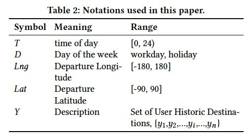

## 目的地预测—业务问题转化

首先求该用户在出发时刻T下出行前往每个目的地的条件概率。

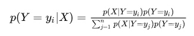

其中$X$是输入的特征，包含用户特征和上下文特征,（时间&经纬度），针对某一个客户，针对不同目的地$y_i$的概率分布为:

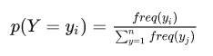

注意这里的目的地候选集合全部都是用户历史去到过的地点。而另一个部分$p(X|Y=y_j)$代表了在给定地点的情况下，估计用户的时间&经纬度分布。

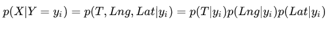

这里作者做了大量统计，发现在给定目的地的情况下，用户出发的时间分布是符合正太分布的。那么该如何得到正太分布的均值和方差了，作者给出了一个巧妙的解法。

首先看看传统方法是怎么解决的。

 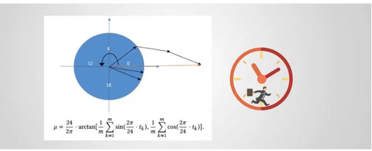

首先计算每一个时刻对应的向量角度，再分别计算它的正弦余弦值来表示它的x，y轴坐标，然后再把计算时刻对应的和向量对应的夹角转化为对应的时刻。

由于每一天的时间是一个按照24小时一轮的循环分布， 直接用用传统高斯分布的方法计算均值和方差是不合理的。 文中提供的方式是把 均值$\mu$ 当做待求解变量，放在一个凸优化问题里面进行求解。 具体如下：

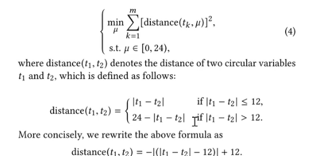

这里说明一下，作者规定距离不能为负，且不能超过12，如果超过则会用24减去。这也很好理解。比如晚上23点和凌晨2点的距离是3小时，但是23-2结果是21，这时需要用24-21得到3。由上式可以得到：

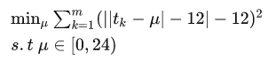

求解出 $\mu$ 后然后 $\sigma$ 也可以通过以下方式得到：

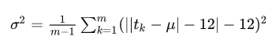

其他特征的条件概率，基本都是按照高斯分布求解参数， 无需赘述。 把统计得到的条件概率代入：

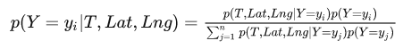

通过这三个特征，算出周日到周六每一天的预测即可。 作者提供了一张展示图， 说明这三个特征可以把数据分的很好。

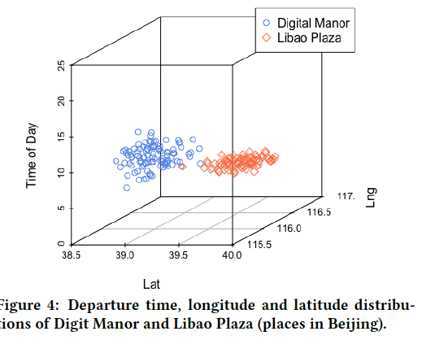

## 总结

1. 根据用户历史订单数据，估计每个目的地的发单时刻集合的均值和方差。
   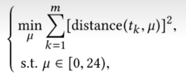
2. 根据当前时间，计算每个目的地的$P(T|x_i)$和频率$P(x_i)$
3. 计算每个目的的概率
   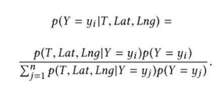
4. 对概率进行排序，设定阈值，返还最优可能。

文章提出的目的地预测模型， 可以说朴实无华却有效。 亮点是用凸优化处理出发时间这种24小时轮询分布的方式简单直接切很有效。

这是一篇典型的AI应用于解决实际问题的例子，从中也可以总结出这种方法的一般步骤。

1. 抽象问题的具体化
2. 探索与尝试新方法
3. 实验与评估
4. 生活场景的新应用
