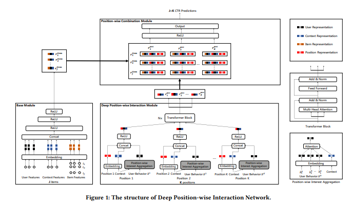

# 背景

CTR预估模型的训练通常采用曝光点击数据，该数据是一种隐式反馈数据，所以会不可避免地产生各种偏差问题，其中，位置偏差对CTR的影响极大而备受关注。用户通常倾向于点击靠前位置的商品，并且CTR会随着曝光位置的增大而迅速下降。因此，直接在曝光数据上进行训练，模型会偏向于靠前位置的商品集合，造成位置偏差的问题。

# 现有方案尝试

## position作为特征

这类方法比较简单，但是在训练、预测的时候还是有很多需要注意的细节，在特征中加入position特征通常有两种方式：

1. 直接将position作为普通特征加入；

2. 将position特征单独构建网络，如利用biasNet建模用户的position bias 然后concat到主网络，或者如YouTube的shallow tower的方式输出对应的logit然后和main tower的logit相加。另外，为了避免过度依赖位置特征，YouTube训练的时候在shallow tower设置drop-out rate 为10%。此时，无论在biasNet还是在shallow tower中，除了position bias信息，也可以额外增加如设备信息等，或者建模用户自身的bias（不同用户具有不同的点击率）等。

   

在预测时，由于商品在送入模型时没有position。通常的做法有以下几种：

1. 将position设置为missing，如上文提到的shallow tower。
2. 给position设置不同的默认值。可以根据线上效果分别尝试然后选择最优的position，通常取position=1，因为离线训练的时候position-1的样本较多。但是不同的position值可能会导致完全不同的推荐结果，并且会影响线上打分的分布（如取position=1 会使得整体的打分偏高）。因此这种方式是次优的，并且由于场景特性不同，不具备泛化性。
3. 暴力遍历法，计算每个item在所有位置的分数，然后通过贪心算法等方式进行排序，但缺点时时间开销过大。

## position作为模块

这类方法的主要思路是将position 单独构建成一个模块，但position模块不参与主网络模块打分计算，然后融合position模块和主网络模块的结果（如两个模块输出的prediction相乘）参与loss的计算，如华为的PAL。

如上图，离线训练单独对position进行建模，将position输出的logit经过sigmoid得到分数probSeen（建模用户看到position的概率），主网络的logit经过sigmoid后得到分数pCTR（建模无偏的打分概率）。然后两个分数相乘得到bCTR，将bCTR与真实的label计算损失。这其实是一种类似Propensity Score的思想。

在预测时，这种方式直接采用主网络的打分pCTR就可以了。

## 蒸馏模型

通过蒸馏的方式也可以使模型学习到position bias信息。主要有两种解决方法，一种是用一份无偏的数据集去训练一个Teacher Network，然后用知识蒸馏的方式指导学生网络，但是这种无偏的数据集在业界往往很难获取。另一种方案是使用[优势特征蒸馏](https://arxiv.org/abs/1907.05171)的方式，将position作为优势特征，教师网络和学生网络使用相同的模型结构，但教师网络增加position特征。

## Multi Head Position

在上文将position作为特征时我们提到了暴力遍历法，这种方案在线上部署时主要的耗时部分在于主网络的重复推理，那么我们其实可以改造一下网络结构，使得主网络在一次推理的情况下就可以输出所有position的打分不就行啦？

网络的结构也很简单，在主网络后面为每个position增加子网络，训练时每个样本只会更新对应position的子网络结构，[美团的DPIN](https://arxiv.org/pdf/2106.05482.pdf)就是如此，直接通过模型预估出item在每个position上的分数，然后线上通过贪心算法实现排序。

上图展示的是整体的网络结构。左下角的base model完成的功能就是对item，user和context信息进行抽象提取，模型就是很简单的特征拼在一起过MLP。中间的部分文中称为Deep Position-wise Interaction Modules，是主体部分。在这一部分如何得到每一个位置上的信息建模呢？把用户曾经在该位置产生的正向行为的序列建模，作为该位置信息的抽象。即position 1这里，仅仅使用用户在1号位置点击过的item的特征建模，灰色这里夹杂了一个小attention，是用context作为key启动的。到了“Transformer Block”下面的这些特征，就已经是每一个对应位置的建模了。这里的transformer block把QKV都设定成了所有位置特征的拼接，然后得到更加综合的表示。我个人理解，把用户行为拆到每一个位置上当然对，但是这样下来每一个位置也很稀疏，这一步大综合相当于做了一个兜底，使得每一个位置最终输出的特征都不会太弱。有了这些结果，接下来就按照上面说的做组合，得到最终结果。

# 新的尝试

## 模型结构

基础主网络
