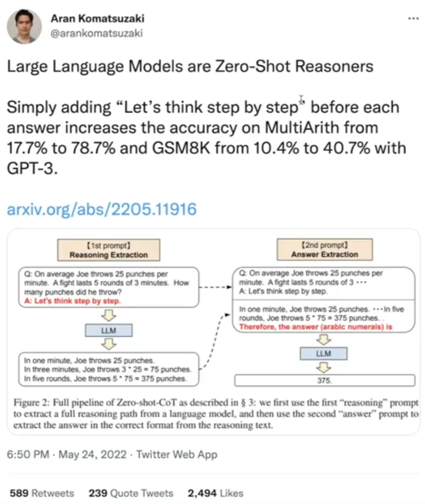
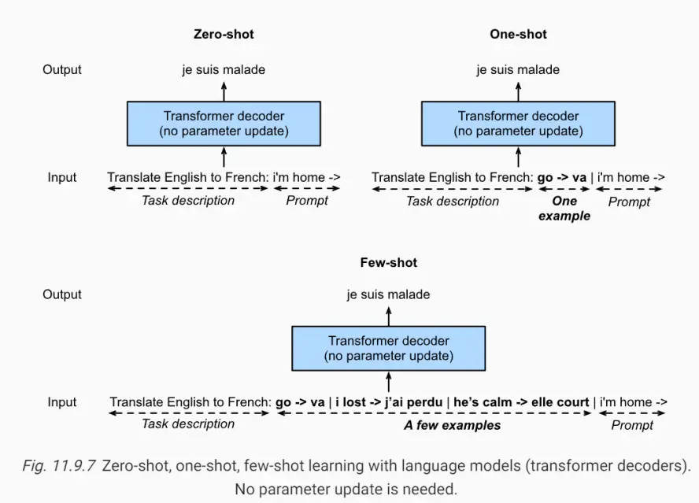
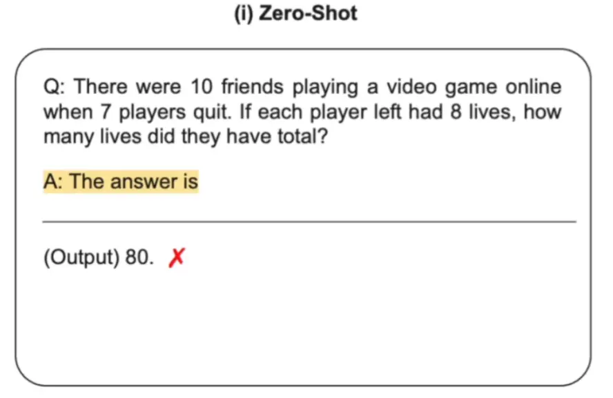
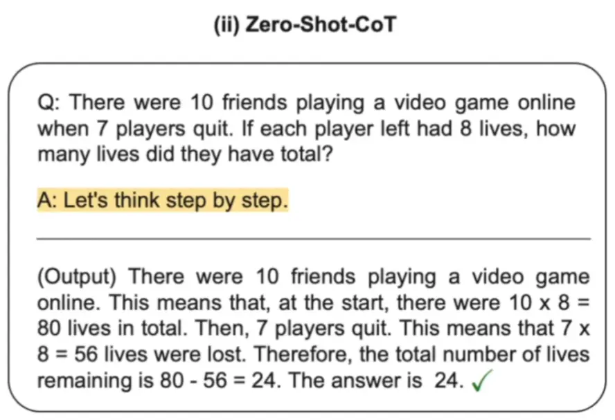
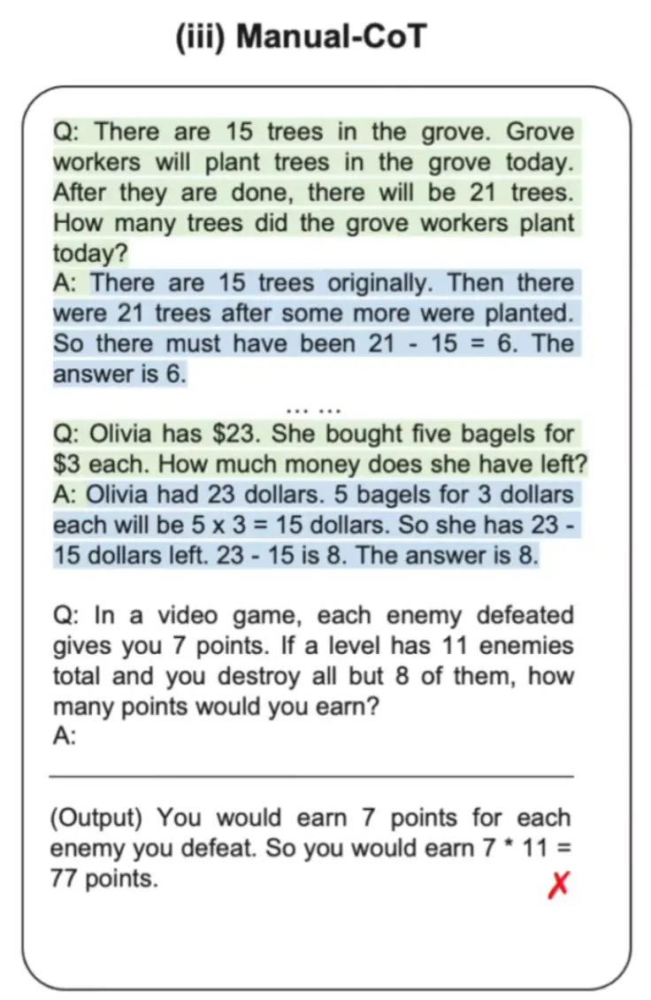

最近large language model 非常火，而CoT（Chain of Thought）作为一种和LLM模型交互的方式一经提出就引发了广泛的关注。这篇文章就主要介绍了通过CoT的方法来使用大模型解决推理任务的一些范式。）<!-- more -->本文参考视频（[链接](https://www.bilibili.com/video/BV1t8411e7Ug/?spm_id_from=333.1007.top_right_bar_window_history.content.click&vd_source=8c6b292e0d1364ecdc0fe7062157584c)）

# 背景知识

这篇文章中说，只要在每个答案之前加上一句“Let's think step by step”，就可以立即在两个比较困难的数学问题数据上涨点，而且涨点非常明显。由于这个方法比较简单，只是加了一句话就能够非常明显地涨点，所以立即引发了大家对于这一领域的关注，也就是“ AI 是不是也需要鼓励来获得更好的表现”。

## **语言模型的本质是对任意一段文本序列的概率进行建模**

如果将语言模型看成一个大黑盒的话，它的输入是一段文本序列，输出也是一段文本序列，通过训练语言模型，就能使得给定的文本序列和输出的文本序列拼接起来所组成的一整段文本序列的概率尽可能比较大。

# 方法

## **如何用 GPT-3 这类的大语言模型来做零样本、单样本和少样本学习?**

对于 GPT-3 来说，也就是图中的 transformer decoder，无论是在零样本、单样本还是少样本的情况下，它们的输入都是一段文本序列，输出也是一段文本序列

少样本与零样本的唯一区别就是中间多出了一些参考样例，它们其实都是在续写前缀（只是零样本的输入没有任何参考，而少样本的输入有一些参考样例来帮助语言模型推断如何根据任务输入生成相应的任务输出）

## **用一个训练好的大语言模型来求解推理任务的几种范式**

### Zero-shot

文献：[Large Language Models are Zero-Shot Reasoners](https://arxiv.org/abs/2205.11916)

语言模型的输入是一道数学题连接一个字符串“The answer is”，然后让语言模型进行续写

### **Zero-Shot-CoT**

语言模型的输入还是一道数学题连接一个字符串“Let's think step by step”，然后让语言模型进行续写

这种情况下，语言模型会续写出中间推理步骤，并最终生成答案。

chain of thought 的定义：在应对推理任务时，在给出最终答案之前所产生的中间推理步骤，他们载体是一系列的短句子

chain of thought 也可以和最后的答案合在一起，作为一个整体。但是作者还是将中间解题步骤叫做 CoT ，这样才能更好地表达模拟人类一步一步思考而最终得出答案的过程这一内涵

因为 CoT 是作者所提出的一个新事物，所以作者强调了 CoT 中几个比较有意思的地方

首先，CoT 原则上能够让模型把一个多步的问题分解出各种中间步骤，使那些具有更多推理步的问题有机会分配到更多的计算量（如果是从最后的将拼接好的问题、答案样例以及所要求解的问题和前缀输入到语言模型中产生最后的答案这一步来看，对于一个更难的问题，在续写的时候，CoT就使得语言模型能够产生更多的中间推理步骤，因为语言模型在生成输出的时候是一个一个 token 进行生成的，那么如果问题越难，CoT 又使得生成的中间步骤越多，那么整体上生成的 token 的数量也会越多，自然而然在求解更难的问题的时候就会使用到更多的计算量。就好比人类在遇到更难得问题的时候，可能就会耗费更多的脑力，这样 CoT 也能够让计算机能够对更难的问题分配更多的计算资源）

CoT 提供了可解释性，也就是在不知道答案的情况下，也能够知道答案是怎样得来的，也就是所谓的中间推理步骤

作者认为 CoT 在原则上能够适用于任何人类能够用语言所能解决的问题，而不仅仅是数学、逻辑、常识这类的问题。因为 CoT 本身的载体就是一系列的短句子，本身也是人类语言

当一个语言模型训练好之后，就能够通过 few-shot prompting 这种范式，在每个样例中写上中间推理步骤，再拼接好所要求解的问题输入到语言模型，就能够引发语言模型续写中间推理步骤，再得出最后的答案（像 Zero-Shot CoT 就发现，甚至都不需要在 few-shot 这些样例中添加 CoT ，可以仅凭“let's think step by step”作为 CoT 的推理；而 Auto CoT ，也就是“Let's think not just step by step but one by one”使用了多个“let's think step by step”就可以自动地构造 few-shot 的样例，从而弥补了 Zero-shot 和 Few-shot 之间的性能差异）。

### Manual-CoT

文献：[Chain of Thought Prompting Elicits Reasoning in Large Language Models](https://arxiv.org/abs/2201.11903)

这种情况下使用到了少样本学习，在输入问题之前，手动设计一些问题和答案的样例（样例的答案给出中间推理步骤），这些问题和答案都需要手动构造，所以叫 Manual-CoT

语言模型的输入是一些手动设计的问题和答案的参考样例连接一个真正需要求解的问题，然后让语言模型进行续写

这里少样本训练中的问题和答案的样例都需要人为构造并手动设计，因此为了和第四种自动 CoT 做区分，这里称为 Manual-CoT

Manual-CoT 比 Zero-Shot-CoT 的性能要好，因为它采用的是 few shot ，在输入中提供了一些问题、中间推理步骤以及答案的样例给语言模型进行参考。但是，提供这些样例需要进行人工设计，这就需要一定的人工成本

### **Auto-CoT**

文献：[Automatic Chain of thought Prompting in Large Language Models](https://arxiv.org/abs/2210.03493)

Auto-CoT 其实也是受到了 Manual-CoT 的启发，既然Manual-CoT 比 Zero-Shot-CoT 的性能要好，而且性能好的关键就在于人工设计的问题、中间推理步骤和答案的样例，那么就可以考虑将这部分进行自动化，从而节省人工成本

实时发现是可行的，做法主要分为两步

1. 通过多样性选取有代表性的问题
2. 对于每一个采样的问题拼接上“Let's think step by step”（类似于 Zero-Shot-CoT ）输入到语言模型，让语言模型生成中间推理步骤和答案，然后把这些所有采样的问题以及语言模型生成的中间推理步骤和答案全部拼接在一起，构成少样本学习的样例，最后再拼接上需要求解的问题一起输入到语言模型中进行续写

最终模型续写出了中间的推理步骤以及答案，并且质量非常高

值得一提的是，在十个数据集上 Auto-CoT 是可以匹配甚至超越 Manual-CoT 的性能，也就说明自动构造的 CoT 的问题、中间推理步骤和答案样例比人工设计的还要好，而且还节省了人工成本

在 Auto-CoT 中，其实也是用到了很多个“Let's think step by step”对每个采样的问题分别触发中间推理步骤和答案，这也是为什么叫它“Let's think not just step by step but also one by one”，也就是AI需要多鼓励几次

# 总结

最近看到ChatGPT这么火，加班肝了一下GPT_1到GPT_3的文章，自己总结了下：

- GPT的主要卖点是用Decoder搞了一个大模型。
- GPT2把战场转移到了Zeor-shot，在更大的数据上训出来了更大的模型
- GPT3又用了更大的数据集和模型，并且提出few-shot会更好，还提出了 in-context learning的概念。
- Instruct GPT在GPT3的基础上用户RLHF做了强化学习。
- Chart GPT 论文还没出，不过应该是在GPT3.5上做了类似Instruct GPT类似的优化。
