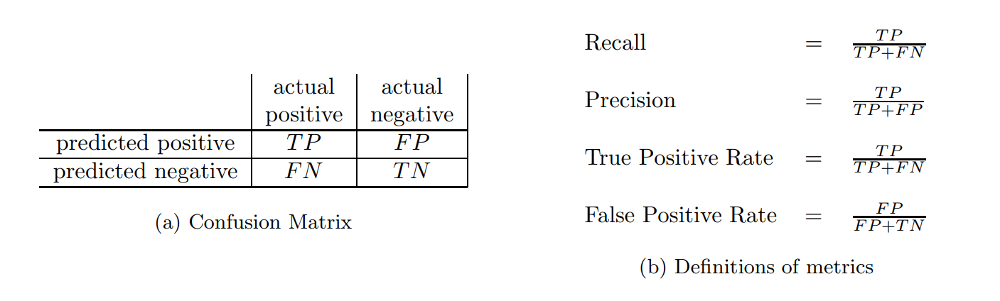
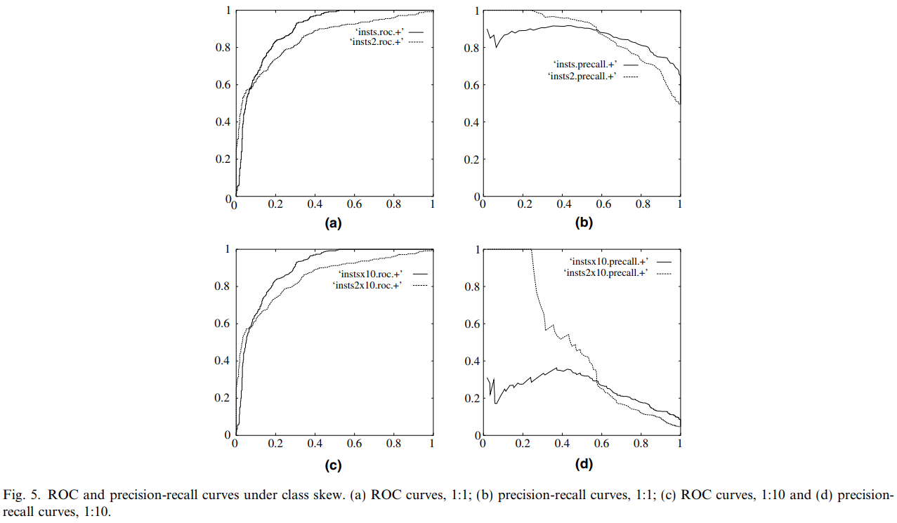

这个月断断续续看了两篇文章，一篇是多场景建模的MMoE，感觉这篇文章的Motivation很make sense ，后面有机会可以尝试一下。另一篇收获不大，就不细说了，不过 最近开始着手模型的训练，在和同事交流时，发现自己对于AUC的理解还不太深刻，于是感觉加班补了一下。

首先要了解AUC，就得知道ROC 曲线和 PR 曲线，ROC 曲线和 PR 曲线是评估机器学习算法性能的两条重要曲线，两者概念比较容易混淆，但是两者的使用场景是不同的。我这里主要讲述两种曲线的含义以及应用的场景。<!-- more -->

## 定义

ROC 曲线和 PR 曲线都是用在二分类中，且涉及到下图的几个概念(摘自 [The Relationship Between Precision-Recall and ROC Curves](https://www.biostat.wisc.edu/~page/rocpr.pdf))

上面四个指标用大白话解释如下

**Recall：查全率，正样本中被预测出来是正的比例(越大越好)
Precision：查准率，预测的正样本中被正确预测的比例(越大越好)
True Positive Rate：跟 Recall 定义一样 （越大越好)
FPR : 负样本中被预测为正的比例(越小越好)**

对于一个二分类问题，往往要设定一个 threshold，当预测值大于这个 threshold 时预测为正样本，小于这个 threshold 时预测为负样本。如果以 Recall 为横轴，Precision 为纵轴，那么设定一个 threshold 时，便可在坐标轴上画出一个点，设定多个 threshold 则可以画出一条曲线，这条曲线便是 PR 曲线。

**PR 曲线是以 Recall 为横轴，Precision 为纵轴；而 ROC曲线则是以 FPR 为横轴，TPR 为纵轴。**

那么两者的关系是怎样的？

## 对比

[The Relationship Between Precision-Recall and ROC Curves](https://www.biostat.wisc.edu/~page/rocpr.pdf) 中证明了以下两条定理

**定理1**：对于一个给定的的数据集，ROC空间和PR空间存在一一对应的关系，因为二者包含完全一致的混淆矩阵。我们可以将ROC曲线转化为PR曲线，反之亦然。

**定理2**：对于一个给定数目的正负样本数据集，曲线 A 在 ROC 空间优于曲线 B ，当且仅当在 PR 空间中曲线 A 也优于曲线 B。

定理 2 中 “曲线A优于曲线B” 是指曲线 B 的所有部分与曲线 A 重合或在曲线 A 之下。**而在ROC空间，ROC曲线越凸向左上方向效果越好。与ROC曲线左上凸不同的是，PR曲线是右上凸效果越好。**

从定理 2 来看，ROC 空间和 PR 空间两个指标似乎具有冗余性，那么为什么还需要这同时两个指标呢？答案是在**两者在样本不均衡的情况下表现有较大差异**。

下图是ROC曲线和Precision-Recall曲线的对比，摘自 [An introduction to ROC analysis](https://ccrma.stanford.edu/workshops/mir2009/references/ROCintro.pdf)

图 (a) 和 (b) 是在样本正负比例为 1:1 下的 ROC 曲线和PR 曲线，图(c) 和 (d) 是在样本正负比例为 1:100 下的 ROC 曲线和PR 曲线。

从结果来看：**当测试集中的正负样本的分布变化的时候，ROC曲线能够保持不变。**

文章 [ROC和AUC介绍以及如何计算AUC](http://alexkong.net/2013/06/introduction-to-auc-and-roc/) 以及[An introduction to ROC analysis](https://ccrma.stanford.edu/workshops/mir2009/references/ROCintro.pdf) 中都认为这是个优点，原因是在实际的数据集中经常会出现类不平衡（class imbalance）现象，即负样本比正样本多很多（或者相反），而 **ROC 这种对不平衡样本的鲁棒性使得其曲线下的面积 AUC 不会发生突变**。

那么，AUC 意味这什么？首先 **AUC 值是一个概率值，表示随机挑选一个正样本以及一个负样本，当前的分类算法根据计算得到的Score值将这个正样本排在负样本前面的概率**。

因此，AUC值实际上反映了模型的 rank 能力，AUC值越大，当前的分类算法越有可能将正样本排在负样本前面。这个指标尤其适用在某些场景下(如 CTR 预估)，每次要返回的是最有可能点击的若干个广告(根据CTR排序, 选择排在前面的若干个)，实际上便是在考验模型的排序能力。除此之外，CTR 中存在着样本不均衡的问题，正负样本比例通常会大于 1:100，如果采用 PR 曲线，则会导致 AUC 发生剧变，无法较好反映模型效果。

然而，**ROC 曲线不会随着类别分布的改变而改变的优点在一定程度上也是其缺点**。因为 ROC 曲线这种不变性其实影响着的是 AUC 值，或者说是评估分类器的整体性能。但是在**某些场景下，我们会更关注正样本，这时候就要用到 PR 曲线了。**

比如说信用卡欺诈检测，我们会更关注 precision 和 recall，比如说如果要求预测出为欺诈的人尽可能准确，那么就是要提高 precision；而如果要尽可能多地预测出潜在的欺诈人群，那么就是要提高 recall。一般来说，提高二分类的 threshold 就能提高 precision，降低 threshold 就能提高 recall，这时便可观察 PR 曲线，得到最优的 threshold。

## 总结

综上，有以下几条结论（参考 [机器学习之类别不平衡问题 (2) —— ROC和PR曲线](https://zhuanlan.zhihu.com/p/34655990)）

1. ROC曲线由于兼顾正例与负例，所以适用于评估分类器的整体性能(通常是会计算AUC，表示模型的rank性能)，相比而言PR曲线完全聚焦于正例。
2. 如果有**多份数据且存在不同的类别分布**。比如信用卡欺诈问题中每个月正例和负例的比例可能都不相同，这时候如果只想单纯地比较分类器的性能且剔除类别分布改变的影响，则ROC曲线比较适合，因为类别分布改变可能使得PR曲线发生变化时好时坏，这种时候难以进行模型比较；反之，如果想测试不同类别分布下对分类器的性能的影响，则PR曲线比较适合。
3. 如果想要评估在**相同的类别分布下正例的预测情况**，则宜选PR曲线。类别不平衡问题中，ROC曲线通常会给出一个乐观的效果估计，所以大部分时候还是PR曲线更好。(参考上面 Quora 的例子)
4. 最后可以根据具体的应用，在曲线上找到最优的点，得到相对应的precision，recall，f1 score等指标，去调整模型的阈值，从而得到一个符合具体应用的模型。
