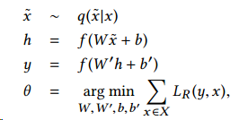
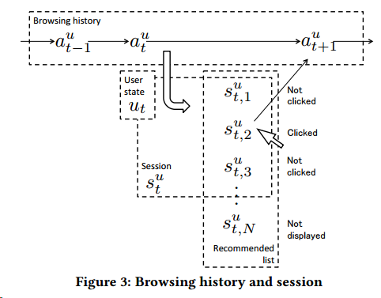

这篇文章是雅虎关于新闻推荐的一篇文章，发在KDD2017上，比较有insight的一篇文章。

传统基于协同过滤或者矩阵分解相关的算法并不适用于新闻的推荐，因为新闻的迭代速度块，短时间内会产生大量的新物品，也会代替掉去多过时的物品，所以新闻推荐的三个关键点在于： - 理解文章的内容 - 理解用户的偏好 - 根据内容和偏好列出给用户推荐的内容<!-- more -->

一个最基础的做法是将文章看作是文本中词的集合，将用户看做历史浏览过的文本所包含词得结合，在推荐时根据两者的相关性将两者匹配进行推荐。这样做足够简单，同时也易于迭代，可以满足新闻推荐的基本需求。

但是这样做也有很多问题： - 第一个就是词的表征问题，两个同样意思的词，却是完全不同的表示，所以这样会导致完全相同的事件，用了不一样的词，变成了完全不同的两个商品 - 第二就是如何处理用户的浏览历史，浏览历史往往是一个序列，如果从序列中获取用户偏好转变的信息也很重要

雅虎新闻推荐的APP主要分了三部分，第一部分是header，一个导航栏，下面是topics module，是人为维护的新闻，再往下是personalized module，是推荐的部分。

主要的推荐由五个部分组成 - identify，提前计算用户的特征 - matching，文章与用户相匹配 - ranking，排序 - de-duplication，去重 - advertising，有可能需要广告植入

对于文章的处理，作者采用了DAE来进行特征提取

因为需要快速计算用户和文章的匹配度，所以作者采用了内积的形式来快速计算匹配度，所以在训练文章的特征时，就需要考虑匹配相似的影响

在对用户的历史浏览行为处理中，要考虑序列的信息

我们需要两个函数，第一个就是计算当前用户状态与文章匹配程度的函数$R(u_t,a)$，另一个就是表示用户当前状态的函数$F$，具体写作

在线推荐时，我们需要足够快计算匹配程度，所以我们用内积来计算匹配程度，足够简单也足够快速，毫秒级的响应，对于当前状态，我们则不用那么高的时效性，因为在用户产生下一个有效动作前，有充足的时间计算。

我们的目标是最大化正例与负例之间的匹配度的差值，同时考虑曝光的bias影响，最后的目标函数为

作者之后提出了五种不同模型来表现用户的当前状态 - Word-based model，前文所述baseline的算法，用出现的词的交集来衡量相似度，这样做难以解决同义词的问题，也面临着稀疏性的难题 - Decaying model，基于词袋模型做了时间的衰减 - Simple recurrent unit，单纯的RNN模型 - Long-short term memory unit，lstm，解决梯度弥散的问题 - Gated recurrent unit，GRU模型，同样用于解决梯度弥散的问题

在后面作者做了离线的和在线的实验，GRU表现较好

由于面对数据规模很大情况，所以作者采用了构建两套系统，一套预测，一套训练，每两周切换一次，以适应新的环境。文中提到训练时间很长，训练超过一周，作者进行过实验，三个月不更新模型，模型效果会退化到一般的baseline水平。

这篇文章到此也就差不多结束了，里面还很多小细节，有意的朋友可以下载去看，总的来说这篇文章是一篇既实用又非常扎实的文章，读完真的很开心~
