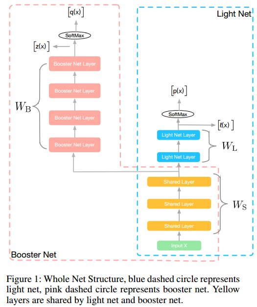
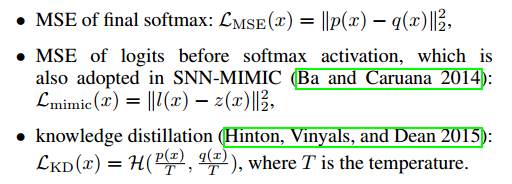

这篇文章发于AAAI2018，阿里的一篇文章。文章主要想法是一种利用teacher-student network，来用简单的网络直接去学习复杂网络的表征，以降低计算的复杂度，应用于在线预测等方面。现在组内用的很多co-train的模型感觉也是这个思路的延续。<!-- more -->

图中可见，主要分为两部分的网络，一部分是booster net，一部分是light net，其中booster net中的层为计算复杂程度较高的网络连接，比如加BN，加ResBlock等等，可以用较深的网络，后面接一个softmax，而light net则是一些较浅、较简单的网络结构，同时两部分还共享前面几层，算是特征提取的层。

该网络的整体损失函数为

主要包括三部分，对booster net的准确性矫正、对light net的准确性矫正和对两个网络表征的矫正，最后一项称为hint loss，两个网络表征的差异程度，而之前的两项可以采用交叉熵作为损失函数。作者在文中考虑了3种hint loss

后面实验作者先用图像做了实验，证明了用light net 可以学到booster net的表征能力，然后又将其用于了CTR prediction。

看完之后还是有些小问题的，做hint loss的时候，为什么直接比较加权求和后的值差异？这样做输入到最后softmax的值一样的话，还在loss层加入各自网络的损失干什么？

总的来说这篇文章还是开了个好头，我顺带着看了文章汇中引用的周志华老师的learnware的文章，周老师描述的是一种可重复、可塑的学习模型，在完成一定基础任务同时，稍微加工就可以完成特定任务的模型，从这篇文章看，可以认为light net是一种轻量级的模型，而booster net则是特定的加工，然后易于部署应用的同时，成为一个好的可扩展框架，的确是个很好的思路。

以前组里分享图像相关的时候，说先训练一个模型，换另外一个loss之后再训练多步，这样可以完成某个任务，当时就很疑惑，这样训练如何保证收敛？如何保证网络真的学到了东西？从这篇文章看，这个思路就很好，通过co-train的方式，用深层网络（specification的网络）来“加工”训练浅层网络（也可以换成general的网络），这种framework总体感觉就相对靠谱多了。
