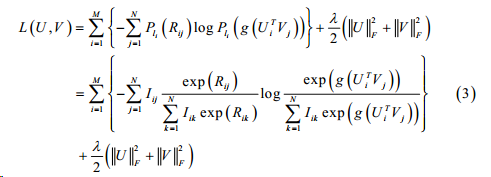

这篇是之前看到的RMF模型，作者的主要contribution在于改进MF的方法，使它保持线性复杂度的同时同时适应于大规模的数据集。<!-- more --> 在进行Learning To Rank（LTR）任务时，CF之类的方法需要解决一下的问题： - 用户和物品并不容易被显示的特征所替代，IR中的LTR往往具有用户query信息和物品的特征，以此匹配排序，但在推荐系统中，往往并没有这样的显示特征可以使用 - 并不是所有的LTR方式都是用于CF的应用，比如pair-wise的方式每次计算一对物品，但是面对推荐系统这么庞大的物品集合，却难以实施。

这篇文中作者提出top-one probability来做list-wise的top-n list优化。定义在用户$i$的排序列表$l_i$中，物品被打分为$R_{ij}$的概率为
$$
P_{li}(R_{ij})=\frac{ϕ(R_{ij})}{∑^K_{k=1}ϕ(R_{ik})}
$$
其中函数$ϕ(x)$可以是单调增严格正的函数。然后根据估计的得分与实际的得分之间的差距来优化loss

然后简单地根据随机梯度下降来优化即可。这篇文章的思路和内网的一篇工作很像，涉及机密就不详说了，最近正好在做LTR模型的优化工作，尝试了一些这两个idea，还是有一定的效果，离线AUC都有0.03左右的提升，不过线上效果还是内网的方法强一些- -。

