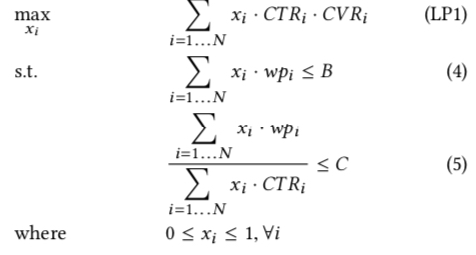
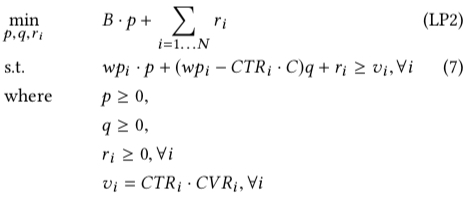
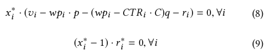
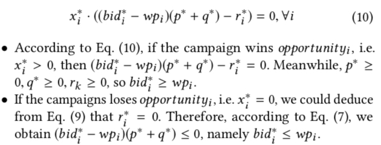
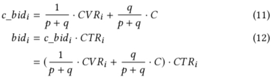

推荐与广告可以说是很多互联网公司的两个重要业务，其中推荐是为了 DAU 的增长，或者说流量的增长，而广告则是利用这些流量进行变现。两者的要解决的问题也很相似，都是在每条流量到来的时候，要从一个庞大的候选集中选出 topk 个候选返回，基本都采用 召回+精排 的架构，中间还可能插入粗排，本质上都是在效果与工程之间做 trade-off。<!-- more -->

如果说两者技术上最大的 diff，我认为是出价，因为在广告场景中引入了广告主(advertiser)这一角色，因此我们除了考虑用户体验，还需要满足金主爸爸们的诉求（如跑量、成本等），才能带来持续的收入增长，而金主爸爸们表达其诉求的最直接的手段就是出价，其含义就是愿意为每个 click/convert 付出多少钱(truthful telling)。这带出来的就是 bidding 这一研究领域，关于这个领域在 [rtb-papers](https://github.com/wnzhang/rtb-papers) 中有很多相关的 paper。

本文主要讲的是 2019 KDD 阿里的 [Bid Optimization by Multivariable Control in Display Advertising](https://arxiv.org/abs/1905.10928)，这篇 paper 解决了出价的两个的核心问题：**出价公式和调价策略**，从最优的出价公式的推导到出价控制器的构建，文章的总体的建模思路非常值得学习，整个推导的 paradigm 能够推广到更一般的出价场景, 实践性也较强，推荐读原文。插个题外话，突然发现这篇文章是老板写的- -！

**出价从技术上可认为主要由两大部分组成：出价公式和控制器**，比如说常见的 cpc 出价公式是 bid * ctr, 最常见的控制器则是 [PID](https://en.wikipedia.org/wiki/PID_controller#:~:text=A proportional–integral–derivative controller,applications requiring continuously modulated control.)。出价公式我们能比较好理解，那为什么要控制器来调价而不是按照广告主给的出价来投呢？我认为主要有以下两个原因

(1) **为了满足广告主的各种诉求**；如需要匀速投放时，即在一天内均匀地花完预算，这样就需要通过控制器来控制运算花费曲线趋势与大盘流量曲线的趋势保持一致；如需要保成本时，需要通过控制器在成本高了时压价, 低了时提价；需要跑量同时允许在成本有略微上涨时，可以在成本可控的情况下更激进一点出出价
(2) **ctr/cvr 的预估不是完全准确的**；常见的 ctr/cvr 高估时，容易导致超成本，因为这时候计算出来的 ecpm = bid×ctr×cvr 也相当于是高估了；其根本原因是在 ctr/cvr 预估中没有一个绝对的 ground truth, 我们能拿到的是点击/转化与否，但是要预估的则是点击/转化的概率

前面提到，paper 中主要讲了两部分内容，最优出价公式的推导和控制器，下面描述的内容也会主要从这两方面进行描述

## 最优出价公式

paper 中要解决的场景是在保住点击成本和预算时，最大化广告主的在所有参竞价值(value)，因此这个优化问题可写成如下形式

上式中的各个符号含义如下

- $N$, 广告计划的总的可参竞次数(opportunities)
- $x_i$, 第 i 次竞价获胜的概率
- $wp_i$ 第 i 次竞价的 winning price，即 bid price 要大于等于这个值才能获胜
- $B$, 计划的总预算
- $C$, 计划设置的点击成本

值得注意的是，我们**不需要直接求解出上面的最优化问题的解，而只是需要求出取值为最优时的的解形式，然后作为最优出价公式**，也就是说我们并不关心上面的 $x_i$ 的最优解取值，而关心的是其他变量满足什么样的形式时，$x_i$ 的解是最优的。

### paper 原始推导

paper 通过最优化中的对偶理论将上面的原问题(primal problem)转为对偶问题(dual problem)，如下图所示；对偶理论的详细描述可参考  [Duality Theory](https://sites.math.washington.edu/~burke/crs/407/notes/section4.pdf) 这个讲义

上图中的 $p,q,r$ 都是对偶问题中变量，对应于原问题中的三类约束：预算，成本和对 $x$ 的范围的约束，根据互补松弛定理(Complementary Slackness) ，可得到下面两个式子, 互补松弛定理的详细描述同样可参考上面的那个链接。

上面的公式中 $x^∗_i$ 和 $r^∗_i$ 分别表示原问题和对偶问题的最优解，后面带 *上标的符号均表示最优解，至此为止，上面都是基于最优化理论推导出来的一些公式，但是**接下来这一步就有点跳了**，paper 中直接令最优出价公式为
$$
bid^* = \frac{1}{p^*+q^*}\times CTR_i \times CVR_i+\frac{q^*}{p^*+q^*}\times C \times CTR_i
$$
则上面那些公式中表示给广告主带来的价值 $v_i$ 可写成 $v_i=bid_i−wp_i$, 将公式（6）代入这个式子，再将 $v_i$ 代入上图中的公式(8)，可得到下面的公式（10）及其分类讨论的结果

上面的两个分类讨论的结果实际上表明了**无论最优解 $x^*$ 是赢得这次竞价($x=1$)还是输掉这次竞价($x=0$)，按照公式(6)进行出价时，总能保证解是最优的**

### 小结

综合考虑上面两部分的推导，可以得到最优的出价公式如上面公式(6)所示，公式中的 $p$ 和 $q$ 是两个超参，是对偶问题中需要求解的变量，**如果需要求解，意味着需要拿到参竞的所有后验数据，但是实际中在参竞时就需要通过这些参数给出参竞的 bid，这似乎就成了一个先有鸡还是先有蛋的问题了**，后面会通过控制器描述如何解决这一问题，具体思想就是不直接求解原始的最优化问题，而是通过近似的方式来逐渐逼近最优解

回到公式(6)的最优出价公式，如果将其写成 `c_bid * ctr` 的形式，有如下公式

## 调价策略
