最近提前去公司实习了，太忙以至于很久没有看论文、写笔记了，之后还是要抽时间多看看论文，尽量保持一周看一篇吧，更新博客就随缘了，这次就先把之前做的一些关于Ctr预估的笔记整理一下。<!-- more -->

## FNN(Factorization-machine supported Neural Network)

### **模型结构**

FNN 是伦敦大学于 2016 在一篇论文中发表的，模型的结构如下

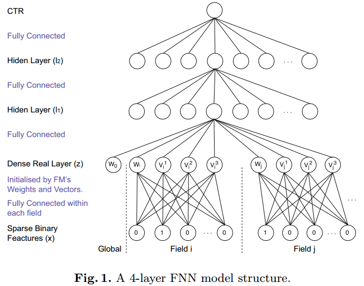

FNN 假设输入数据的格式是离散的类别特征(表示为 one-hot 编码)，且每个特征属于一个 field，通过 embedding 层将高纬稀疏特征映射成低维稠密特征后，再作为多层感知机(MLP)的输入。

一般来说，embedding 层的参数可以随机初始化，但是在 FNN 中，初始化 embedding 是采用通过 FM 预训练得到的每个特征的隐向量，**这样初始化的好处是将预训练的向量作为初始化参数时，能够让模型的参数在初始化的时候就处于较优的位置(训练的目的其实就是为了得到最优的模型参数)，能够加快收敛的过程**，至于效果方面，则不一定会优于随机初始化的情况，因为随机初始化经过多轮的迭代也可能会收敛同样的效果。

### **相关论文**

提出 FNN 的论文 [Deep Learning over Multi-field Categorical Data: A Case Study on User Response Prediction](https://arxiv.org/abs/1601.02376)是[张伟楠](http://wnzhang.net/)博士在伦敦大学时发表的，张伟楠博士还有很多与 RTB 相关的论文，具体可参看其主页。

### **开源实现**

论文作者在 github 上的 [deep-ctr](https://github.com/wnzhang/deep-ctr) 这个仓库中提供了 FNN 的代码，但是是 Theano 实现的；后来作者又将代码更新为 Tensorflow 框架实现的，详见 [product-nets](https://github.com/Atomu2014/product-nets)，这个仓库也包含了后面要介绍的 PNN 的实现代码。

## Wide&Deep

### **模型结构**

Wide & Deep 是 Google 在2016年6月中发布的。模型结合了传统的特征工程与深度模型：既有 Wide 的 LR 模型，也有 Deep 的 NN 模型。

其结构如下所示

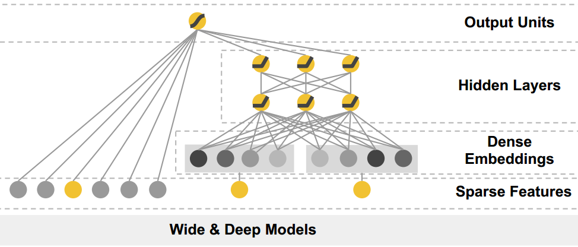

wide 部分其实就是 LR，deep部分其实就是 FNN，只是 deep 部分中的 embedding 层不用 FM 训练得到的隐向量初始化。根据论文的描述，wide 部分主要负责memorization， deep 部分主要负责 generalization；memorization 主要指的是记住出现过的样本，可以理解为拟合训练数据的能力，generalization 则是泛化能力。

根据论文的实验，wide & deep 比起单纯的 wide 或 deep 都要好，但是根据我后面的实验以及网上的一些文章，wide 部分仍然需要人工设计特征，在特征设计不够好的情况下，wide&deep 整个模型的效果并不如单个的 deep 模型。

Wide&Deep 中还允许输入连续的特征，这点与 FNN 不同，连续特征可以直接作为 Wide 部分或 Deep 部分的输入而无需 embedding 的映射，具体如下图所示。

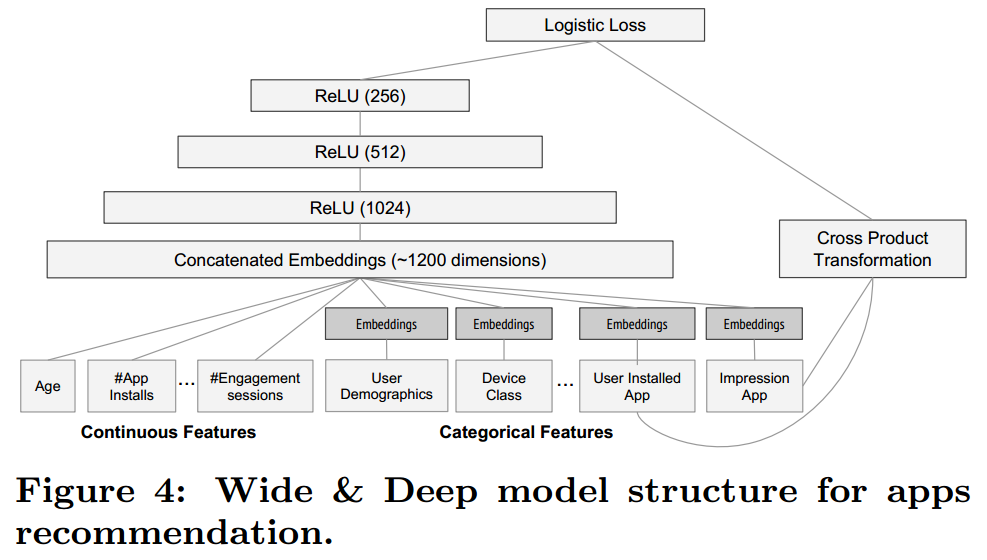

### **相关论文**

Wide&Deep 是 Google 在论文 [Wide & Deep Learning for Recommender Systems](https://arxiv.org/abs/1606.07792) 中提出的，论文原来是用于 Google Play 的推荐中，但是推荐和CTR实际上是同一类的问题：排序问题，所以也可以迁移到CTR预估的领域。

### **开源实现**

由于 Wide&Deep 是 google 提出的，因此在自家的框架 Tensorflow 中提供了 Wide&Deep API，具体的使用方法可参考官方的文档 [TensorFlow Wide & Deep Learning Tutorial](https://www.tensorflow.org/tutorials/wide_and_deep)。

## PNN(Product-based Neural Networks)

### **模型结构**

PNN 是上海交大在2016年发表的，FNN 是在 PNN 的基础上进行了改进，就是增加了特征的二阶交叉项。因此，FNN 和 PNN 的关系，类似于 LR 和 FM 的关系，只是 FNN 和 PNN 均是对原始特征进行了 embedding 映射。PNN 模型的结构如下所示

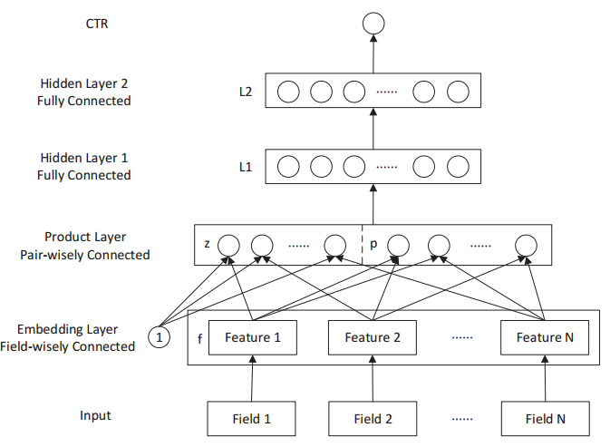

特征经过 embedding 层映射后，有两种乘积的操作，第一种是跟1做外积，实际上就是将映射后的特征进行拼接, 得到了上图中的 z 向量部分；第二种是与其他特征分别两两进行内积，得到了上图中的 p 向量部分，这个操作其实就相当于进行了特征交叉，只是这种交叉是在 embedding 映射后。再后面的结构其实又是一个多层感知机了。

### **相关论文**

PNN 是在上海交大于2016年在这篇论文 [Product-based Neural Networks for User Response Prediction](https://arxiv.org/abs/1611.00144) 中提出。

### **开源实现**

PNN 的作者在 github 上的 [product-nets](https://github.com/Atomu2014/product-nets) 上开源了其代码，通过 Tensorflow 实现，代码里面也包含了 FNN，DeepFM 等一些其他模型的实现。

## DeepFM

### **模型结构**

DeepFM 是华为诺亚方舟实验室在 2017 提出的用于 CTR 预估的模型，DeepFM 其实就是模仿 Wide&Deep，只是将 Wide 部分替换成了 FM，所以创新性并不算大。其结构如下所示

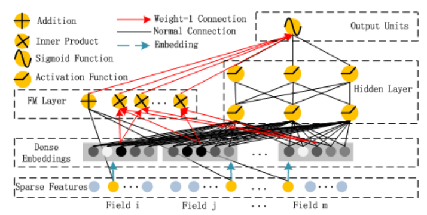

### **相关论文**

DeepFM 是在这篇论文中提出的 [DeepFM: A Factorization-Machine based Neural Network for CTR Prediction](https://arxiv.org/abs/1703.04247)

### **开源实现**

作者没有公开源码，上面提到的 [product-nets](https://github.com/Atomu2014/product-nets) 提供了这个模型的实现代码，同时 [tensorflow-DeepFM](https://github.com/ChenglongChen/tensorflow-DeepFM) 也提供了一个 tensorflow 实现的版本，star 数是 github 上较高的了。

## DIN(Deep Interest Network)

### **模型结构**

从之前提到的几个模型可知，CTR预估中的深度学习模型的基本思路是将原始的高维稀疏特征映射到一个低维空间中，也即对原始特征做了embedding操作，之后一起通过一个全连接网络学习到特征间的交互信息和最终与CTR之间的非线性关系。这里值得注意的一点是，在对用户历史行为数据进行处理时，每个用户的历史点击个数是不相等的，我们需要把它们编码成一个固定长的向量。以往的做法是，对每次历史点击做相同的embedding操作之后，将它们做一个求和或者求最大值的操作，类似经过了一个pooling层操作。提出 DIN 的论文认为这个操作损失了大量的信息，于是引入了 attention 机制(其实就是一种加权求和)。

DIN 是阿里妈妈在 2017 年提出的，其模型的结构如下所示

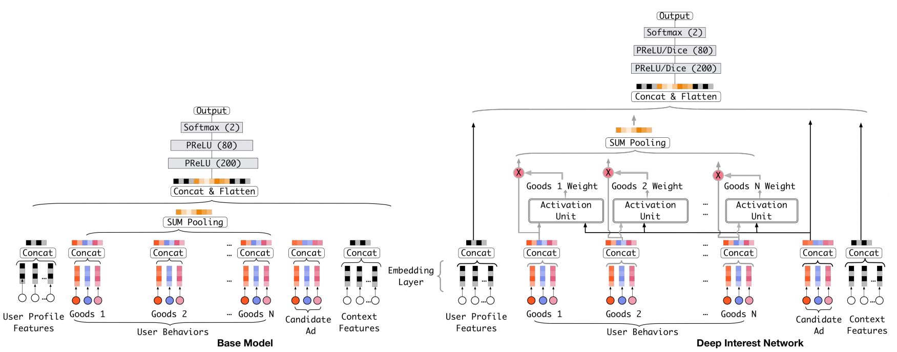

Activation Unit 的结构如下所示

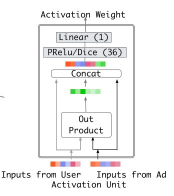

DIN模型在对用户的表示计算上引入了attention network (也即图中的Activation Unit) 。DIN把用户特征、用户历史行为特征进行embedding操作，视为对用户兴趣的表示，之后通过attention network，对每个兴趣表示赋予不同的权值。**这个权值是由用户的兴趣和待估算的广告进行匹配计算得到的**，如此模型结构符合了之前的两个观察——用户兴趣的多样性以及部分对应。attention network 的计算公式如下， $V_u$ 代表用户表示向量， $V_i$ 代表用户兴趣表示向量， $V_a$ 代表广告表示向量，$w_i$ 表示各个用户兴趣表示向量的权重，$g$ 是 Activation Unit 的逻辑，论文中提出了一种如上图的 Activation Unit 所示，当然也可自行设计新的 Activation 方法。

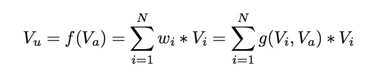

### **相关论文**

DIN 是在论文 [Deep Interest Network for Click-Through Rate Prediction](https://arxiv.org/abs/1706.06978) 中提出的。

### **开源实现**

论文作者在 github 上的仓库 [DeepInterestNetwork](https://github.com/zhougr1993/DeepInterestNetwork) 开源了其代码，通过 Tensorflow 实现。

## Deep&Cross

### **模型结构**

PNN 进行了特征的二阶交叉，目前是为了获得信息量更多的特征，除了二阶，三阶四阶甚至更高阶的特征会更加有区分度；Deep&Cross 就是一个能够进行任意高阶交叉的神经网络。

Deep&Cross 是 StandFord 和 Google 与 2017年 提出的，类似于 Wide&Deep，模型也是由两部分组成，分别是 Deep network 和 Cross network，该模型结构如下所示

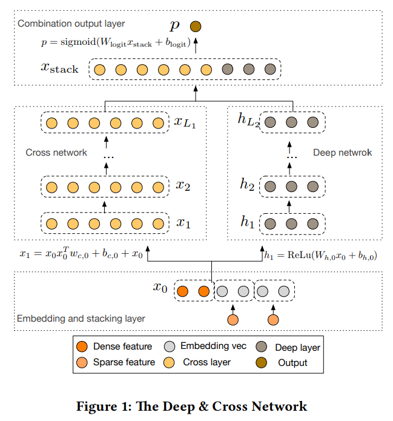

$x_i$表示可由如下公式确定

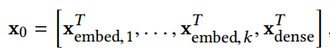

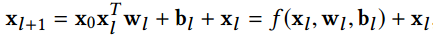

从上面两条公式可知，Cross network 中的第 l+1�+1 层的神经元由最原始的输入和第 l� 层的神经元共同决定，因此第 l� 层相当于对原始特征进行了 l� 阶交叉。

### 相关论文

Deep&Cross 是在这篇论文 [Deep & Cross Network for Ad Click Predictions](https://arxiv.org/abs/1708.05123) 中提出的。

### 开源实现

论文没有公开代码，[DeepCTR](https://github.com/shenweichen/DeepCTR) 中提供了 Deep&Cross 的 tensorflow 实现，可供参考。

## 总结

在CTR预估中，模型适用传统方法还是深度学习方法，其实是一个**海量离散特征+简单模型** 和 **少量连续特征+复杂模型** 的权衡。既可以离散化用线性模型，也可以用连续特征加深度学习。特征与模型往往是对偶的，前者容易，而且可以n个人一起并行做，有成功经验；后者目前看很赞，能走多远还须拭目以待。
