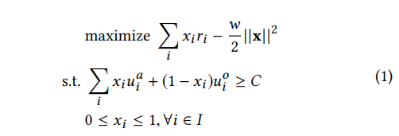
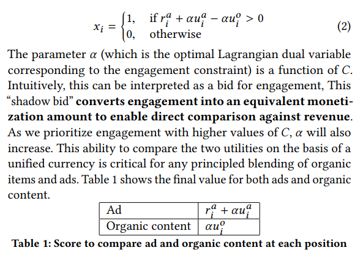
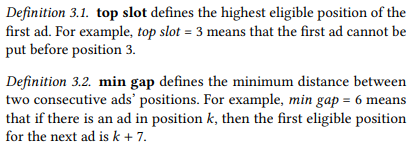
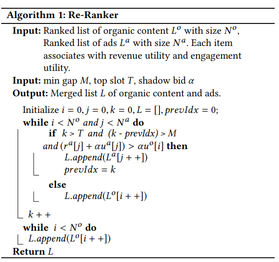
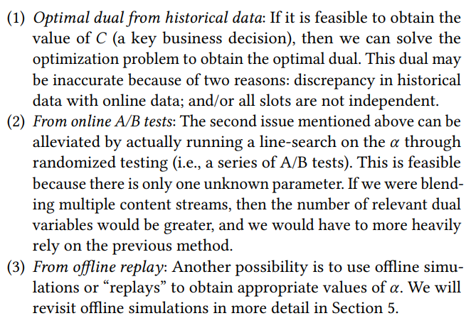
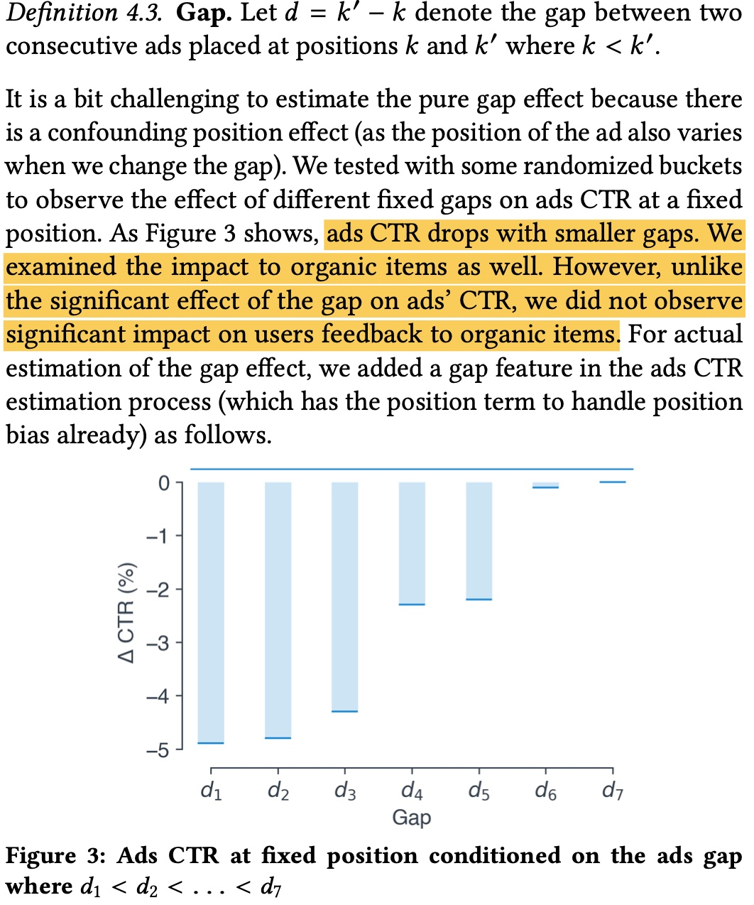
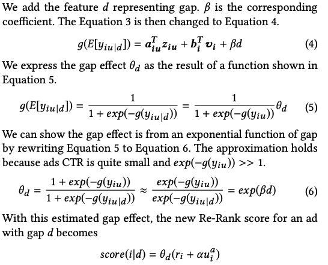
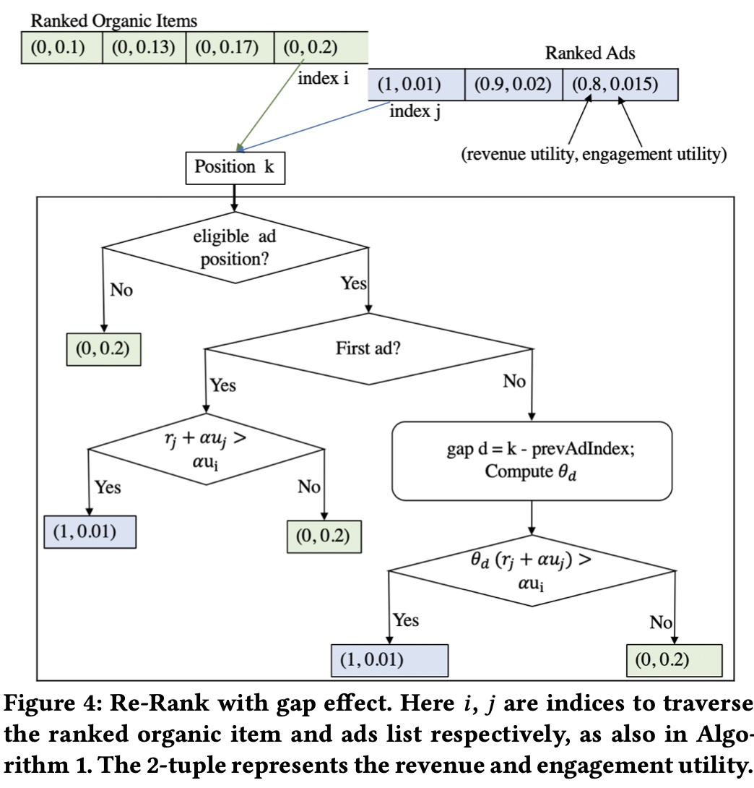

混排，往往是的推荐系统的最后一个环节，在这个阶段，自然内容（后面简称item）需要与营销内容（后面简称 ad）进行混合，生成最终推送给用户的 list

如果以 Long Term Value(LTV)的视角来看,这是个在 LT 和 V 之间做 trade-off 的过程，ad 如果出得过多，必然会挤压 item 的数量和位置，进而影响用户体验和留存即 LT，但相应的广告收入，或者说 Average revenue per user([ARPU](https://www.investopedia.com/terms/a/arpu.asp)) 会提升，反之亦然。<!-- more -->

所以业界往往的做法是定一个用户体验的约束，在这个约束下尽可能优化 ad 的效率，即达到收入最大化，因此很自然可以把这个建模成一个最优化问题，LinkedIn 在 2020 年的这篇 paper就是这么做的，[Ads Allocation in Feed via Constrained Optimization](https://dl.acm.org/doi/pdf/10.1145/3394486.3403391)

直观地看混排这个问题，有 2 个子问题需要解决
（1）怎么计算每个 item 或 ad 在每个位置上的价值：因为 item 和 ad 是各自排序的，目标不同，最终的值的量纲也不同，这么把两者的 scale 拉到可比范围是一个需要讨论的问题
（2）怎么分配能让最终 list 价值最大化：在 item 和 ad 的价值确认后，怎么插入 item 和 ad 的位置，从而达到整个 list 的最大化

上面提到的 LinkedIn 的 paper 重点是在解决第二个问题，部分内容也涉及到第一个问题 ；本文会先讲一下这篇 paper 的建模方法，然后讨论下计算 item 和 ad 价值的一些思路，混排中一些其他需要注意的事项

## 建模方案

paper 把问题建模成如下图最优化问题（单次请求的最优，目前不考虑请求间的优化）

各符号含义如下

- $i$: 一次请求中位置的 index
- $x_i$: 是否在第 i 个位置插入ad
- $j$: 请求的 index
- $u^o_i$: item 在第 i 个位置的 engagement utility（可理解为内容本身的价值，item和ad都有）
- $u^a_i$: ad 在第 i 个位置的 engagement utility
- $r_i$: ad 在第 i 个位置的 revenue utility（可理解为商业价值，item没有这个价值）
- $C$: 全局 engagement utility 的一个门槛, 一种可能的方式是设置成可能最大的 engagement utility（没有广告） 的一个百分比

通过对偶拉格朗日可以求解出如下的解，式子中的 $α$是上面第一个约束的拉格朗日乘数；这个变量的物理含义是一个 bid，paper 称其为 “shadow bid”，作用是把 engagement utility 的 scale 变换至 revenue utility 的 scale；则最终在位置 i 插入 ad 或 item 的价值如下图表 1 所示

上面的最优化问题的约束只是总体 list 的 engagement utility 要大于特定预制，但混排往往还有一些硬约束，在paper中提到的是：top slot 和 min gap ，分别表示第一个广告的位置约束，两个广告最小间隔的约束；除了这两个约束，一些常见的约束还有 showtime gap 约束（出现广告的评率）、ad load 约束等(广告出现比例的约束)

这两个约束并没有直接体现在最优化的建模里，而是体现在最后的混排算法里，整个算法流程如下

## 建模关键问题讨论

上面的建模虽然比较直观，但涉及到的一些需要解决的关键问题，

### shadow bid $α$ 的计算

paper 提到的 shadow bid，在经济学上称为[影子价格](https://zh.wikipedia.org/wiki/影子价格)，物理含义是表示的是增加一个单位的资源所带来的边际收益，关于影子价格更多讨论可参考 [线性规划中的影子价格怎么理解？](https://www.zhihu.com/question/23510001)

这里的影子价格 $α$是一个关于 $C$ 的函数，paper 提到获取这个值的三种方法，

从上图可知，基本思路是
（1）确定 $C$ 的值之后求解原问题，得到 $α$
（2）通过在线 ab 实验来确定这个参数
（3）离线回放（感觉这里跟第一个是重合的，因为求解原问题也是需要回放历史数据，只是用多长的历史数据，以及更新频率有多大）

### $u^o_i$、$u^a_i$ 和 $r_i$的计算

关于这几个值的获取，paper 并没有提供明确的方法，只是提到了 **$u^a_i$、 $u^o_i$ and $r_i$ are drawn from the same distribution as was the historical data**

但如果真的这么做，存在的问题必然是历史数据会很稀疏，容易出现新的 item 或 ad 没有数据，或者把统计历史数据的维度拉得更大，这样容易导致效果变差，数据没区分性；因此，最终还是需要往预估方向去做

如果考虑实际的业务，$u^o_i$ 和 $r_i$ 的值比较好获取，直接取原本 item 排序和 ad 排序中各自的分数即可，但 $u^a_i$ 的值应该如何获取？（其实这里的 $u^o_i$ 和 $r_i$ 的值的获取还有个问题，就是怎么获取一个 item 或 ad 在所有位置的 $u$ 或 $r$，这部分在下面的 position bias 会讨论）

如果让 ad 直接走推荐侧的模型，在物理意义上是 make sense 的，但可能会存在 2 个问题（1）ad 的特征未必能跟 item 的完全对齐（2）需要保证 $u^a_i$<$u^o_i$

对于这里的第二个问题，笔者有点疑惑，在Feeds流中，肯定会有一些广告商品本身的自然效率也是很高的，感觉没必要进行一个这样的现在，更应该考虑的是，如果广告品自身能竞得某个位置，加上revenue utility可能会竞得一个更好的位置，那么如何根据这个改变来进行二价计费的修改，这个以后会介绍一些做法。

### position bias

这个问题在上面的 $u^a_i$ 、$u^o_i$  和  $r_i$ 的获取讨论中提到了如果在计算 $u^a_i$ 、$u^o_i$  和  $r_i$不考虑位置信息，那必然是有偏的，因为不同位置的 ctr、cvr 等天然不一致

paper 里提到了一种方法，也是实际比较常用的：**training 阶段使用实际的 position，serving 阶段使用统一的 position，同时保留一张映射表，映射不同位置跟 serving 时使用的统一位置的 discount，映射表可通过后验数据统计获取得到，最终预估值乘上这个 discount 就能等到不同位置的预估值**

这种做法的缺点是这张映射表需要经常更新，所以更好的做法是把这张表做到模型里，让模型训练过程中就能学到这个变化，预估阶段同时预估所有的位置的 score。

关于这个问题，笔者在工作中也做过一些尝试，并取得了不错的效果，后面有空可以介绍一下~

### gap effect

对于推荐而言，往往序准确就可以了，但 a**d 因为涉及到实际扣费，会要求 ctr，cvr 预估足够准确**，才能避免扣费不准确，引起广告主的客诉等问题

除了上面的 position bias 会影响 ctr 准确性，两个 ad 之间的 gap 大小也会影响 ad 的 ctr 等，如下图所示，ad 的 gap 之间如果过小，ad 的点击率会过低，但 item 不会出现这种情况，本质上还是因为 ad 的密集度过高，即使前面提到了有min-gap 这一类硬规则

paper 提出的做法是给增加一个 gap 特征来捕捉这个信息，paper 做了如下推导，最终生效的形式跟 position_discount 有点像，等价于在原来的 ctr 基础上乘上一个 gap_discount, 下图中的 $g$ 是 [Logit function](https://en.wikipedia.org/wiki/Logit), $y_{ij}$ 表示是否发生点击（还可进一步把 $β$ 参数化，做成个性化的参数）

而如果在上面的混排算法上加上 gap effect 的影响，会有如下的流程

## item 与 ad 价值度量的另一种思路

paper 认为 item 价值是 engagement utility，ad 的价值是 engagement utility + revenue utility

而上面也提到了获取 ad 的 engagement utility 会比较难，因此可以也可以考虑使用另一种思路来度量 item 和 ad 的价值

因为涉及到扣费，ad 的价值是比较好衡量的，一般采用的是 ecpm = bid × ctr × cvr（为了讨论方便，此处省略hidden_cost），因此很自然的一个想法是，**能否为每个 item 也赋予一个 bid，这样也能在 item 侧算出一个类似 ecpm 的指标，与 ad 侧能进行比较**

紧接着的问题是，item 侧的 bid 的含义是什么？ad 侧的 bid 是有明确的物理含义的：广告主愿意为一个转化付的钱（还会叠加调价策略修改原始的广告主出价），但在 item 侧并没有广告主这一角色，由谁来出这个 bid 呢？

最直观的方法就是基于 ad 和 item 各自预估值的量级的差异，拍一个 item 侧的全局固定的 bid，但这样显然不是最优的，而且这个 bid 的量级也需要及时监控和更新，因为随着迭代，两边的预估值的 sacle 会发生变化

而如果从另一个角度来看，ad 更多是表达广告主的诉求，目标就是要更多的用户转化；item 更多是平台的诉求， 目标是要为平台带来更多的用户和留存时间；留存时间越长，也意味着可供平台变现的流量会更多，或者说**用户指标其实也是跟平台长期收入挂钩的**；因此可以基于大盘来测算用户指标与平台收入的关系，以 stay_duration 为例，可以对 stay_duration 分桶，测算 stay_duration 与平台长期收入指标的相关关系，建立一个函数 $f$使得 $bid=f(stayduration)$ 当然这里的变量也不一定是 stay_duration，也可以是考虑 dislike、active 等各种信号，关键是要**把用户在平台的留存、活跃等信息，与平台长期收入量化挂钩，然后基于这个收入倒推出一个 item 侧的 bid**

对于 ad 而言，如果与 item 混排时，把 ad 插在 items 的第 $k$位带来的收益, 不仅仅是广告本身的 ecpm，还可进一步考虑由于广告插入给总体 items 带来的损失（VCG 计费的思想），即**混排时 ad 的价值也可以考虑成“ad 带来收益 - item 后移的损失”**；这样的话如果插入的位置导致 item 后移的损失较大，则总体的 ad 价值会下降，避免对 item 的挤压

## 硬规则是否最优

上面提到了混排中存在着各种硬规则，比如说广告出现的首位，广告之间的min_gap，show_time gap等，从技术角度来说，这样的离散的硬规则显然不是最优的，会极大限制算法的搜索空间；而从业务的角度，这种硬规则往往是业务发展初期拍定的，随着业务发展，对当前业务是否合理也是需要重新评估的

举个例子，一个对 ad 敏感和一个对 ad 不敏感的用户，使用同一套硬规则并不是最优的，因为同样的广告频率，在敏感用户那转化率会比较低，同时对用户的留存影响也会比较大（相对于不敏感的用户）；而如果给对 ad 不敏感的用户出更多的 ad，同时减少敏感用户的ad，打平总体的 ad 数，最终总体的 engagement utility 和 revenue utility 理论上也是更优的

具体的实现上，一般需要设置一套规则和计算方法，能够计算出硬规则中的所有可能情况下的 utility，然后加入到 list 的总体价值中

而这其实也涉及到推荐或广告系统里的优化的一个方向，就是个性化，一般大盘策略上对所有用户都相同的超参或策略，都会有个性化的空间

当然在这个过程也要注意个性化往往也会有个限制，以混排为例，需要对不敏感的用户有体验保护，不能逮住这部分用户一个劲地薅

## 小结

本文从 LinkedIn 的一篇 paper 展开，介绍了混排需要解决的问题以及一种建模方法，paper 的建模不复杂，关键是建模中使用的各个 utility 的获取，paper 在这部分并没有说得比较详细，可能也是因为这部分跟实际业务耦合比较紧密；因此，本文后面也讨论了一种 item 和 ad 价值可能的计算方式：为 item 计算一个 bid， 同时考虑 ad 插入对 item 的影响

另外，paper 也提到了 position bias 、gap effect 等在混排中常见的问题，本文针对 paper 提出的方法和业界的一些做法做了讨论

最后，也探讨了一个比较比较开放的问题，就是混排中涉及到的 hard rule，hard rule 一般是红线，但从技术视角来看肯定不是最优的，同时 hard rule 是否合理，以及如何从业务角度和技术角度来 soften the hard rule，拿到 engagement utility 和 revenue utility 两部分的收益，也许是个值得讨论的问题

